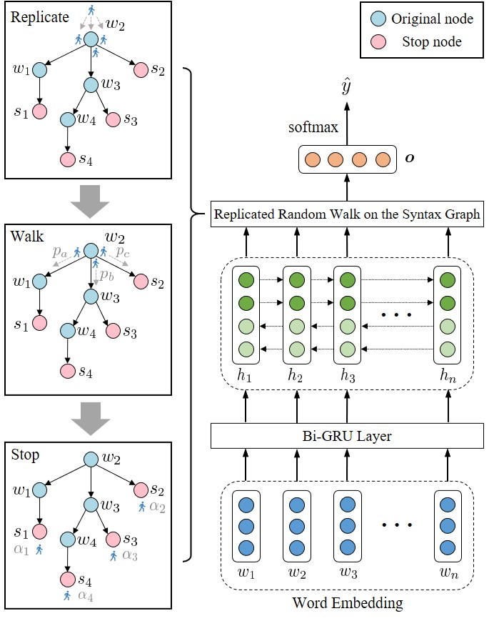

# RepWalk

Code and dataset for our AAAI 2020 paper "Replicate, Walk, and Stop on Syntax: an Effective Neural Network Model for Aspect-Level Sentiment Classification".

You can download the paper via: [[Github]](https://github.com/hiyouga/RepWalk/blob/master/paper.pdf) [[DOI]](https://doi.org/10.1609/aaai.v34i05.6517).

## One-Sentence Summary

RepWalk effectively utilizes the dependency grammar to tackle the aspect-level sentiment classification task via performing a replicated random walk on the syntax graph for learning a better sentence representation.



## Abstract

Aspect-level sentiment classification (ALSC) aims at predicting the sentiment polarity of a specific aspect term occurring in a sentence. This task requires learning a representation by aggregating the relevant contextual features concerning the aspect term. Existing methods cannot sufficiently leverage the syntactic structure of the sentence, and hence are difficult to distinguish different sentiments for multiple aspects in a sentence. We perceive the limitations of the previous methods and propose a hypothesis about finding crucial contextual information with the help of syntactic structure. For this purpose, we present a neural network model named RepWalk which performs a replicated random walk on a syntax graph, to effectively focus on the informative contextual words. Empirical studies show that our model outperforms recent models on most of the benchmark datasets for the ALSC task. The results suggest that our method for incorporating syntactic structure enriches the representation for the classification.

## Requirement

- Python 3.6
- PyTorch 1.2.0
- NumPy 1.17.2

## Preparation

### Clone

```bash
git clone https://github.com/hiyouga/RepWalk.git
```

### Create an anaconda environment [Optional]:

```bash
conda create -n repwalk
conda activate repwalk
pip install -r requirements.txt
```

### Prepare the training data:

- The dataset files are already in the `data` folder.
- The directory structure is as follows:
```
data
├── Restaurants_Trial.json
├── Restaurants_Train.json
├── Restaurants_Test.json
├── Laptops_Trial.json
├── Laptops_Train.json
├── Laptops_Test.json
├── Tweets_Train.json
├── Tweets_Test.json
├── Restaurants16_Trial.json
├── Restaurants16_Train.json
└── Restaurants16_Test.json
```

### Download the pretrained embeddings:

- Download pre-trained word vectors [here](https://nlp.stanford.edu/projects/glove/).
- Extract the [glove.840B.300d.zip](http://nlp.stanford.edu/data/glove.840B.300d.zip) to the `glove` folder.

## Usage

### Train the model:

```bash
python train.py --dataset [dataset]
```

### Show help message and exit:

```bash
python train.py -h
```

## File Specifications

- **model.py**: Description for the model architecture.
- **data_utils.py**: Used functions for data preprocessing.
- **layer.py**: Description for the LSTM layer.
- **loss_func.py**: The loss function for optimizing the models.
- **train.py**: The scripts for training and evaluating the models.

## Citation

If this work is helpful, please cite as:

```bibtex
@inproceedings{zheng2020replicate,
  title={Replicate, Walk, and Stop on Syntax: an Effective Neural Network Model for Aspect-Level Sentiment Classification},
  author={Yaowei, Zheng and Richong, Zhang and Samuel, Mensah and Yongyi, Mao},
  booktitle={{AAAI}},
  year={2020}
}
```

## Acknowledgments

This work is supported partly by the National Natural Science Foundation of China, by the Beijing Advanced Innovation Center for Big Data and Brain Computing (BDBC), by State Key Laboratory of Software Development Environment and by the Beijing S&T Committee.

## Contact

hiyouga [AT] buaa [DOT] edu [DOT] cn

## License

MIT
